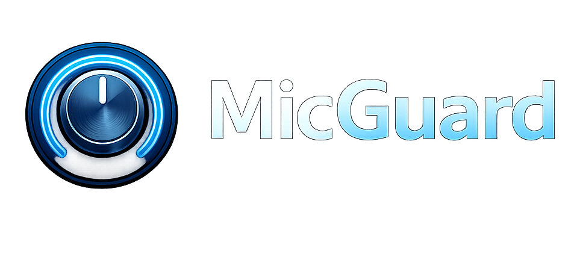
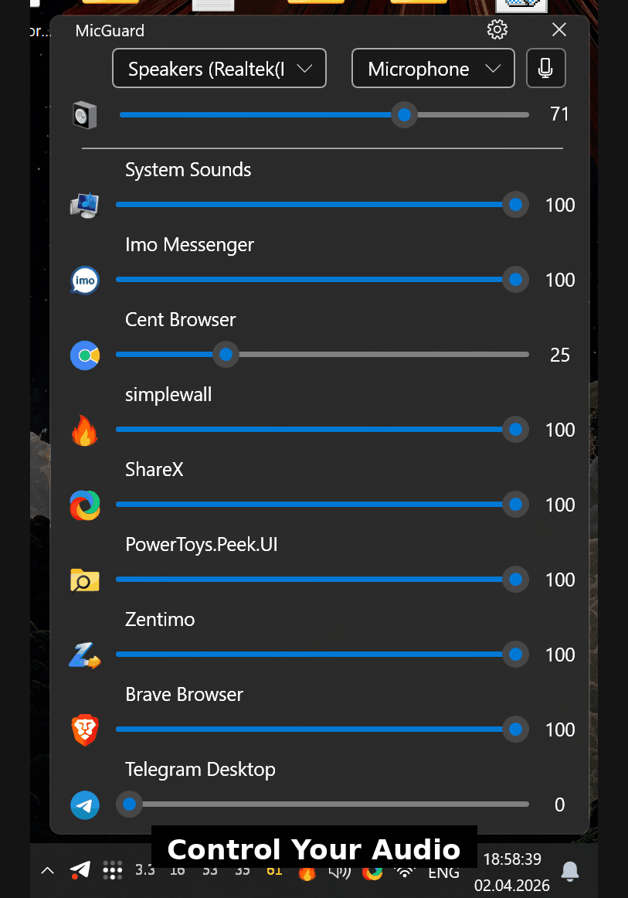

  

  
  
  
  
  
  

  A lightweight Windows audio utility that keeps your preferred microphone selected, blocks unwanted device takeovers, and gives you fast per-app volume control from a clean tray-first workflow.

  <a href="#download">Download</a> |
  <a href="#capabilities">Capabilities</a> |
  <a href="#demo">Demo</a> |
  <a href="#get-started">Get Started</a>

---

## The Problem

Windows audio behavior is often unpredictable:

- the wrong microphone becomes default
- reconnecting devices resets your preferred input
- app volume is spread across multiple system panels
- quick audio actions take too many clicks

MicGuard consolidates these actions into one stable, always-available tool.

---

## Capabilities

### Default Microphone Protection

Choose the microphone you actually want and keep it as the active default input.

- auto-reapply preferred microphone after reconnects and system changes
- enforce default input across `Console`, `Multimedia`, and `Communications`
- avoid accidental switches during calls, recording, and streaming

### Unwanted Device Blocking

Prevent temporary or low-priority devices from hijacking your input path.

- block selected microphones from becoming default
- maintain a predictable audio setup
- reduce failures in meetings, streams, and voice workflows

### Per-App Volume Control

Adjust audio sessions directly inside MicGuard.

- view active sessions in one place
- set volume per application instantly
- avoid opening multiple Windows audio dialogs

### Taskbar Volume Scroll

Control system volume from the taskbar using the mouse wheel.

- configurable scroll step
- optional volume OSD
- middle-click mute support

---

## Demo

  

---

## Get Started

1. Download the latest installer from [Releases](https://github.com/vadlike/MicGuard/releases/latest).
2. Run `MicGuardSetup-<version>.exe`.
3. Choose `Standard` or `Portable` install mode.
4. Select your preferred microphone.
5. Enable `Auto Guard`.

After setup, MicGuard keeps your microphone routing stable in daily use.

---

## Download

| Asset | Description |
|---|---|
| `MicGuardSetup-<version>.exe` | Windows installer package |

Latest release:

- <https://github.com/vadlike/MicGuard/releases/latest>

---

## Technical Snapshot

| | |
|---|---|
| Product type | Windows audio utility |
| Platform | Windows 10 / 11 |
| Distribution | Installer (`Standard`, `Portable`) |
| License | GPL-3.0 |

---

## License

Distributed under the [GNU General Public License v3.0](LICENSE).

---

Built by <a href="https://github.com/vadlike">VADLIKE</a>

